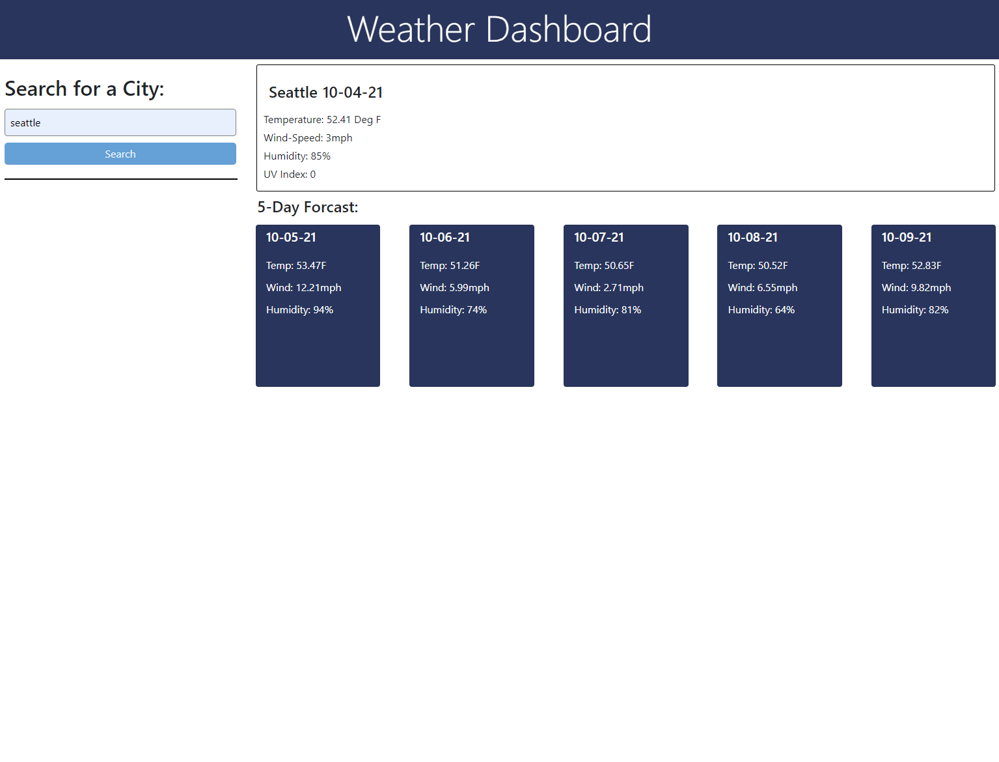

# 06 Server-Side APIs: Weather Dashboard

## Work Description

<pre>
    This weather dashboard was created in order to provide the user with fast weather information. It uses
the Open Weather API by the name of a city and then presents the current day forecast along with the next
5 days. 
    The information provided in the presentation is going to include the temperature, wind speed, humidity
and on the current day it will also provide the UV Index. Some of the aspects of this weather dashboard do
need improvement such as the addition of buttons after a search call is made that will allow a prior city
search to be easily brought forth again and saved to local storage. I also plan to add the proper icons
and background shading to the UV Index within the next week. 
</pre>

## User Story

```
AS A traveler
I WANT to see the weather outlook for multiple cities
SO THAT I can plan a trip accordingly
```

## Acceptance Criteria

```
GIVEN a weather dashboard with form inputs
WHEN I search for a city
THEN I am presented with current and future conditions for that city and that city is added to the search history
WHEN I view current weather conditions for that city
THEN I am presented with the city name, the date, an icon representation of weather conditions, the temperature, the humidity, the wind speed, and the UV index
WHEN I view the UV index
THEN I am presented with a color that indicates whether the conditions are favorable, moderate, or severe
WHEN I view future weather conditions for that city
THEN I am presented with a 5-day forecast that displays the date, an icon representation of weather conditions, the temperature, the wind speed, and the humidity
WHEN I click on a city in the search history
THEN I am again presented with current and future conditions for that city
```

## Mock-Up

The following image shows the web application's appearance and functionality:



## Credits
Built with [JavaScript](https://www.javascript.com/), [Moment](https://momentjs.com/) and [BootStrap](https://getbootstrap.com/)

Deployed with GitHub

Link to the Deployed Site: [Weather Dashboard](https://polsen-92.github.io/Weather_Dashboard/)

## License

MIT license 
Copyright © 2020

## Creator

 <br>
Paige Olsen
[Github](https://github.com/POlsen-92) ,
[LinkedIn](https://www.linkedin.com/in/paige-olsen-2aba9685/)